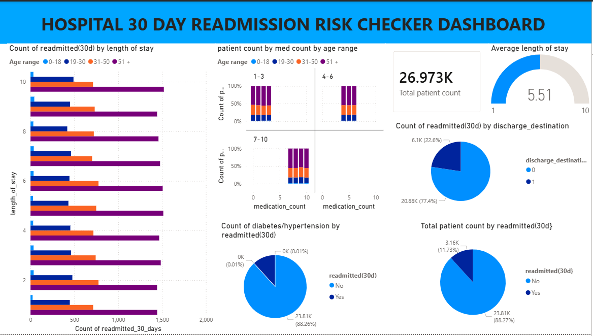

#  Hospital Readmission Risk Predictor



##  Project Overview

The **Hospital Readmission Risk Predictor** is a healthcare data analytics project designed to estimate the risk of a patient being readmitted within **30 days of discharge**. This project simulates realistic hospital workflows using SQL and Python, and presents results through an interactive **Power BI dashboard** that supports clinical decision-making and quality improvement.

Hospital readmissions are often indicators of care quality, discharge planning effectiveness, and care transition coordination. By identifying high-risk patients early, healthcare providers can design targeted interventions to reduce preventable readmissions.


##  Project Objectives

- Analyze patient admission and discharge data to estimate readmission risk.
- Identify key clinical and demographic factors associated with readmissions.
- Build a predictive model that supports healthcare teams in decision-making.
- Visualize insights via an interactive Power BI dashboard.


##  Tools & Technologies

This project uses the following tools:

- Python (data processing, modeling)
- SQL / SQLite (data storage & querying)
- Jupyter Notebook (documentation & analysis)
- Power BI (dashboard & visualization)
- GitHub (project versioning)


##  Dataset Description

The dataset used in this project is anonymized and structured to represent common clinical variables including:

- Patient demographics (age, gender)
- Admission and discharge details
- Length of hospital stay
- Previous admissions
- 30-day readmission indicator (target)

All data is de-identified and used for educational purposes only.


##  Analytics Workflow

1. **Data Loading and Cleaning**  
   Raw patient data is cleaned and prepared for analysis.

2. **Database Storage**  
   Processed data is loaded into a relational database using SQLite.

3. **Model Training**
   Train a Logistic Regression model to estimate the probability of 30-day readmission.

4. **Model Evaluation**  
   Performance metrics (e.g., accuracy, recall, ROC-AUC) assess the model’s validity.

5. **Dashboard Visualization**  
   Results and insights are presented in a Power BI dashboard for interactive exploration.


##  Predictive Insights

This project highlights the following insights:

- **Multiple prior admissions** are associated with higher readmission risk.
- **Longer hospital stays** correlate with increased readmission likelihood.
- **Older patients** show a higher risk of readmission within 30 days.

These insights can inform clinical teams in discharge planning and post-discharge care coordination.


## 📊 Power BI Dashboard

An interactive dashboard is included as a **Power BI template file** (`powerbi/Readmission_Risk_Dashboard.pbit`). To explore:

1. Open the `.pbit` file in **Power BI Desktop**
2. Connect your own dataset or a sample dataset
3. Refresh the dashboard to see visual insights

This dashboard includes:
- Risk stratification charts
- Key performance indicators
- Filters for age, diagnosis, and discharge disposition


##  How to Run This Project

1. Clone the repository:
   ```bash
   git clone https://github.com/brianmtepe/hospital-readmission-risk-predictor

 
 


 


