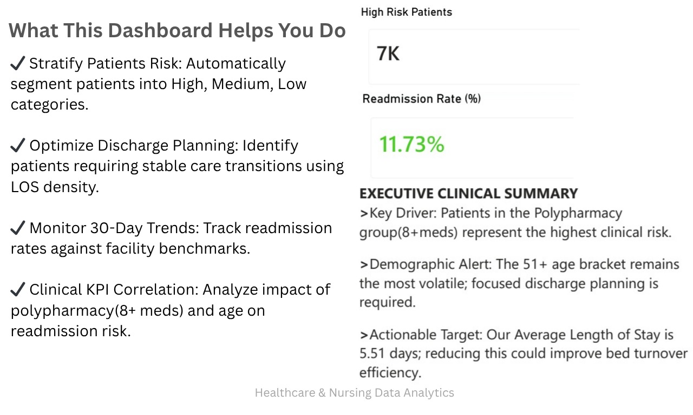
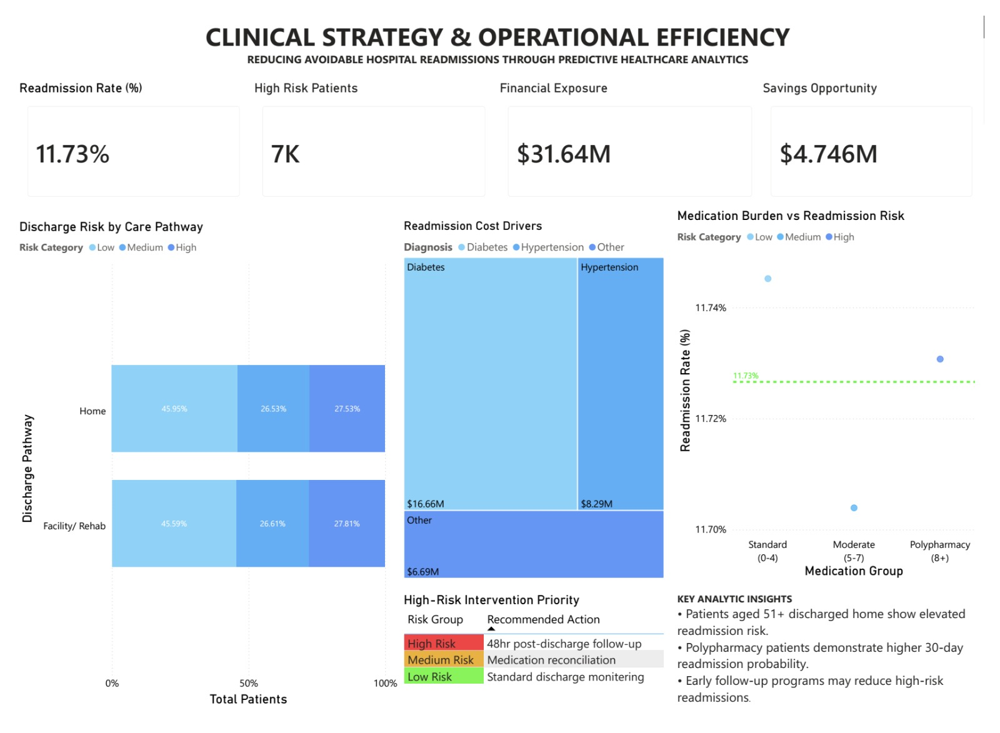

# Hospital Readmission Analytics & Risk Prediction System

## Overview

Healthcare analytics project focused on identifying hospital readmission patterns, high-risk patient groups, and operational risk factors using Power BI, SQL, and Python.

The project combines clinical insight with data analytics to support readmission monitoring, discharge planning, and healthcare decision-making.

---

# Dashboard Pages

## 1. Executive Readmission Overview



### Highlights
- Readmission rate monitoring
- High-risk patient overview
- Executive clinical summary
- Key healthcare KPIs

---

## 2. Clinical Performance Analysis


### Analysis Areas
- Readmission trends
- Length of stay analysis
- Polypharmacy impact
- Discharge pathway monitoring

---

## 3. Care Pathway Optimization



### Operational Insights
- Financial exposure analysis
- Medication burden correlation
- Readmission cost drivers
- Intervention prioritization

---

# Problem Statement

Hospital readmissions within 30 days are associated with increased healthcare costs, resource strain, and gaps in discharge planning and follow-up care.

Understanding readmission drivers can support earlier intervention and improve patient management strategies.

---

# Solution Overview

This project analyzes hospital readmission data to identify patterns associated with increased readmission risk.

The dashboard supports:
- Risk stratification
- Readmission trend analysis
- Operational monitoring
- Clinical insight visualization

Built using:
- SQL
- Power BI
- Python

---

# Key Insights

- Patients with moderate length of stay (3–8 days) showed elevated readmission patterns
- Polypharmacy (high medication count) was associated with increased readmission risk
- Facility-based discharge pathways demonstrated higher readmission trends
- Older patient groups showed higher risk profiles

---

# Clinical Recommendations

- Strengthen medication reconciliation workflows
- Improve discharge planning processes
- Introduce early post-discharge follow-up
- Prioritize monitoring for higher-risk patient groups

---

# Core Features

## Risk Stratification
- Patient grouping into Low, Medium, and High-risk categories

## Operational Analytics
- Length of stay analysis
- Readmission trend monitoring
- Financial exposure tracking

## Interactive Dashboards
Dynamic filtering by:
- Age group
- Risk category
- Discharge destination

## Predictive Modeling
- Logistic Regression model for readmission risk estimation

---

# Tools & Technologies

| Tool | Purpose |
|---|---|
| SQL | Data cleaning and transformation |
| Power BI | Dashboard development and visualization |
| Python | Data analysis and predictive modeling |
| scikit-learn | Logistic Regression modeling |

---

# Business Value

This project demonstrates how healthcare data analytics can support:
- Readmission monitoring
- Early risk identification
- Operational decision-making
- Patient outcome improvement initiatives

---

# Project Status

- ✅ Executive Readmission Overview
- ✅ Clinical Performance Analysis
- ✅ Care Pathway Optimization
- 🚧 Predictive Risk Stratification

---

# Author

## Brian Mtepe, KRCHN
Healthcare Data Analyst

Github: https://github.com/brianmtepe

```
