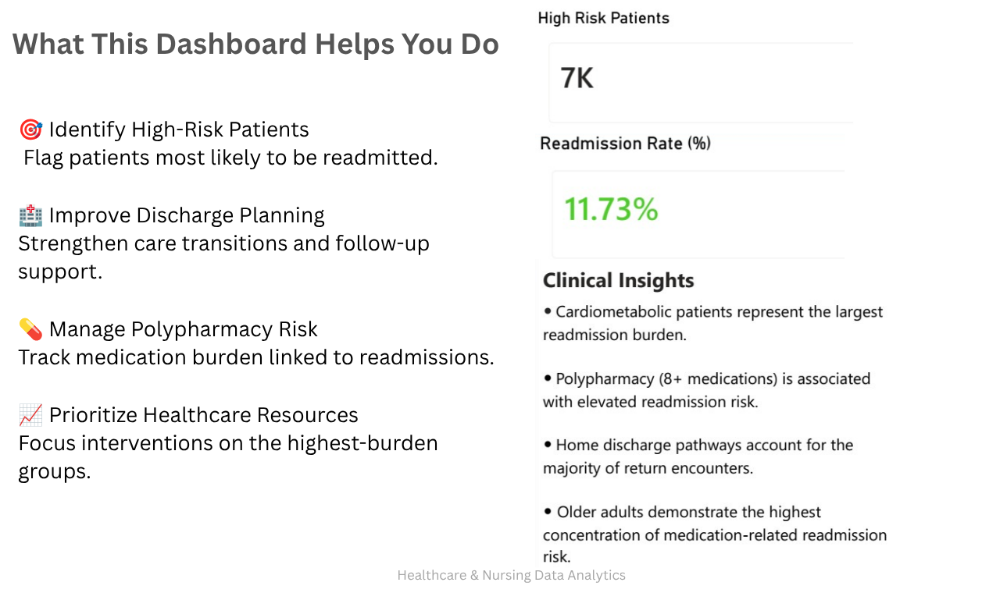
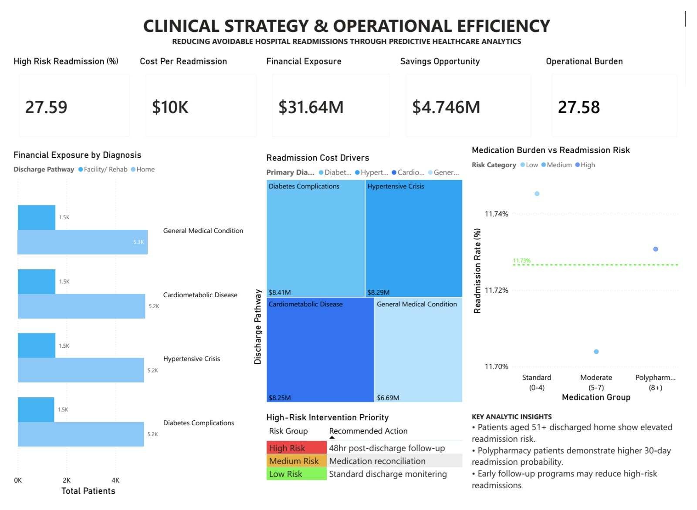

# 🏥 Hospital Readmission Analytics & Risk Prediction Dashboard

## **Clinical Intelligence for Reducing 30-Day Hospital Readmissions**

This healthcare analytics project was developed to identify readmission patterns, high-risk patient populations, and operational drivers contributing to 30-day hospital readmissions.

Using **SQL**, **Python**, and **Power BI**, the solution transforms clinical data into actionable insights that support discharge planning, risk stratification, and healthcare decision-making.

---

## **Executive Summary**

Hospital readmissions are a major challenge for healthcare systems, contributing to increased costs, resource utilization, and adverse patient outcomes.

This project analyzes patient-level clinical data to identify factors associated with elevated readmission risk and presents findings through an interactive Power BI dashboard designed for healthcare leaders, analysts, and quality improvement teams.

---

## **Dashboard Pages**

### **1. Executive Readmission Overview**

Executive-level summary of readmission performance and patient risk indicators.

#### **Highlights**
* **Readmission rate monitoring**
* **High-risk patient overview**
* **Executive KPI tracking**
* **Clinical performance summary**

---

### **2. Clinical Performance Analysis**

Analysis of readmission trends, patient characteristics, and operational drivers.

#### **Analysis Areas**
* **Readmission trends**
* **Length of stay analysis**
* **Polypharmacy impact assessment**
* **Discharge pathway evaluation**

---

### **3. Care Transition & Financial Risk Analysis**

Assessment of care transitions, medication burden, and financial exposure associated with readmissions.

#### **Operational Insights**
* **Financial risk exposure**
* **Medication burden correlation**
* **Readmission cost drivers**
* **Intervention prioritization opportunities**

---

## **Problem Statement**

Thirty-day hospital readmissions are frequently associated with:
* **Inadequate discharge planning**
* **Poor care transition processes**
* **Medication management challenges**
* **High-risk chronic disease populations**

Healthcare organizations require timely and accurate analytics to identify vulnerable patient groups and implement targeted interventions before avoidable readmissions occur. Traditional reporting methods often fail to provide sufficient visibility into underlying clinical and operational risk factors.

---

## **Solution Overview**

A multi-page Power BI analytics solution was developed to:
* **Monitor hospital readmission performance**
* **Identify high-risk patient cohorts**
* **Evaluate operational and clinical risk factors**
* **Support evidence-based healthcare decision-making**
* **Transform raw clinical data into actionable insights**

### **Workflow**
* **SQL data extraction and transformation**
* **Python (Pandas) data cleaning and preprocessing**
* **Power BI dashboard development**
* **Clinical KPI reporting and visualization**

---

## **Project Objectives**

* **Monitor 30-day readmission performance**
* **Identify high-risk patient populations**
* **Evaluate polypharmacy-related risk**
* **Assess discharge pathway outcomes**
* **Support healthcare quality improvement initiatives**
* **Enable data-driven operational decision-making**

---

## **SQL Analytics Highlights**

The project utilizes SQL extensively to transform raw healthcare records into analysis-ready datasets.

### **Data Cleaning & Standardization**
* **Diagnosis normalization**
* **Missing value validation**
* **Duplicate record management**
* **Data quality checks**

### **Feature Engineering**
* **Age cohort creation**
* **Risk stratification categories**
* **Polypharmacy segmentation**
* **Clinical cohort development**

### **Readmission Analytics**
* **Readmission rate calculations**
* **Length of stay analysis**
* **Discharge pathway assessment**
* **Patient outcome tracking**

### **Advanced SQL Techniques**
* **Common Table Expressions (CTEs)**
* **Window Functions**
* **CASE WHEN Logic**
* **Aggregate Functions**
* **Multi-table Joins**
* **Data Quality Validation Queries**

### **Repository SQL Files**
* `01_database_setup.sql`
* `02_feature_engineering.sql`
* `03_analytics_views.sql`
* `04_data_quality_checks.sql`

---

## **Key Clinical Insights**

| Indicator | Finding |
| :--- | :--- |
| **Length of Stay** | Moderate stays (3–8 days) showed elevated readmission patterns |
| **Polypharmacy** | Higher medication burden correlated with increased readmission risk |
| **Age Groups** | Older patients demonstrated higher-risk profiles |
| **Care Transitions** | Certain discharge pathways exhibited higher readmission rates |
| **Risk Cohorts** | Readmission risk varied substantially across patient groups |

---

## **Dashboard Features**

* **Multi-page interactive Power BI dashboard**
* **Patient risk stratification**
* **Clinical KPI monitoring**
* **Length of stay analysis**
* **Polypharmacy tracking**
* **Financial risk evaluation**
* **Interactive filtering and drill-down capabilities**

---

## **Technical Workflow**

### **Data Preparation**
* **SQL data extraction**
* **Python (Pandas) preprocessing**
* **Dataset transformation and validation**

### **Dashboard Development**
* **Power BI data modeling**
* **DAX calculations**
* **KPI development**
* **Interactive healthcare visualizations**

### **Reporting**
* **Executive dashboard reporting**
* **Clinical performance monitoring**
* **Healthcare decision-support analytics**

---

## **Technical Stack**

| Category | Tools Used |
| :--- | :--- |
| **Data Cleaning** | Python (Pandas) |
| **Database** | SQL |
| **Visualization** | Power BI |
| **Predictive Analytics** | scikit-learn |
| **Version Control** | Git & GitHub |

---

## **Business Value**

This project demonstrates how healthcare analytics can support:
* **Early identification of high-risk patients**
* **Improved discharge planning**
* **Enhanced operational monitoring**
* **Reduced readmission-related costs**
* **Better healthcare resource allocation**
* **Quality improvement initiatives**

---

## **Intended Users**

* **Hospital Administrators**
* **Clinical Quality Teams**
* **Healthcare Data Analysts**
* **Health Informatics Professionals**
* **Operational Managers**
* **Recruiters and Portfolio Reviewers**

---

## **Limitations**

* **Educational portfolio project**
* **Demonstration dataset**
* **Simplified risk modeling approach**
* **Not intended for direct clinical deployment**

---

## **Project Status**

Completed as a professional healthcare analytics portfolio project focused on:
* **Readmission monitoring**
* **Clinical risk stratification**
* **Healthcare operations analytics**
* **Executive dashboard reporting**

---

## **Author**

### **Brian Mtepe**
**KRCHN Registered Nurse | Healthcare Data Analyst**

#### **Specializations**
* **Healthcare Analytics**
* **SQL**
* **Python**
* **Power BI**
* **Clinical Informatics**
* **Monitoring & Evaluation (M&E)**
* **Data Visualization**

---

> *Transforming healthcare data into actionable clinical and operational insights.*
